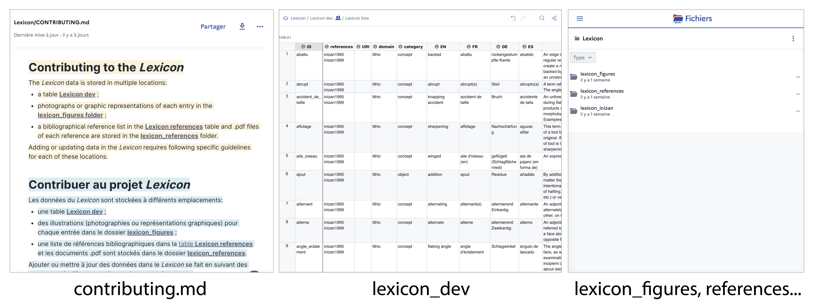

# Lexicon

## The project
Our aim with this repository is to provide a collaborative tool to create, edit and curate a **Multilingual Lexicon of Technological Analyses in Archaeology**.\
\
*L'objectif de ce projet est la constitution d'un outil collaboratif pour créer, éditer et mettre régulièrement à jour un&#x20;****Lexique multilingue de l'approche technologique en archéologie****.*

## Contributing
We welcome all contributions regardless of language. In order to do so please follow the instructions listed in the **Guidelines** section of **[contributing.md](https://docs.numerique.gouv.fr/docs/bcc05c76-9e9c-45cc-8605-fce49f7a9555/?utm_source=docssharelink\&utm_campaign=bcc05c76-9e9c-45cc-8605-fce49f7a9555)**. A compilation of technological terms and definitions is now collected on an online spreadsheet **[lexicon_dev](https://grist.numerique.gouv.fr/o/docs/eFjHz1ZNQ6io/Lexicon-dev?utm_id=share-doc)**. Figures are stored in .jpeg or .png format in a dedicated folder **[lexicon_figures](https://fichiers.numerique.gouv.fr/explorer/items/d0206165-ba5d-45dc-9df6-571239717de1)**. Bibliographical references documented in the spreadsheet are stored in .pdf format in a dedicated folder **[lexicon_references](https://fichiers.numerique.gouv.fr/explorer/items/c75cfb30-8050-40b8-8351-e0dd954c27c0)**.\
\
*Nous invitons toute contributions au projet quel que soit la langue de l'entrée. Pour cela merci de suivre les&#x20;****instructions en français****&#x20;disponibles dans&#x20;***[contributing.md](https://docs.numerique.gouv.fr/docs/bcc05c76-9e9c-45cc-8605-fce49f7a9555/?utm_source=docssharelink\&utm_campaign=bcc05c76-9e9c-45cc-8605-fce49f7a9555)**. *La compilation des entrées qui constituent le Lexicon se fait maintenant dans une table en ligne&#x20;****[lexicon_dev](https://grist.numerique.gouv.fr/o/docs/eFjHz1ZNQ6io/Lexicon-dev?utm_id=share-doc)****. Les illustrations sont collectées au format .jpeg ou .png dans un dossier dédié* ***[lexicon_figures](https://fichiers.numerique.gouv.fr/explorer/items/d0206165-ba5d-45dc-9df6-571239717de1)***. *Les références bibliographiques renseignées dans le Lexicon sont stockées au format pdf dans un dossier dédié&#x20;****[lexicon_references](https://fichiers.numerique.gouv.fr/explorer/items/c75cfb30-8050-40b8-8351-e0dd954c27c0)****.*

## Reporting errors
If you find errors or discrepancies in the data, please [open an issue](https://github.com/tupuni/lexicon/blob/main/CONTRIBUTING.md#1-2-procedure-to-suggest-modifications) to discuss it.

## Authors and acknowledgment
This project is initiated by [Solène Denis](https://umrtemps.cnrs.fr/en/membre/denis-solene-2/) and [Aymeric Hermann](https://umrtemps.cnrs.fr/en/membre/hermann-aymeric-2/).
<!-- This project currently involves by Solène Denis (CNRS, UMR8068), Aymeric Hermann (CNRS, UMR8068), Jean-Philippe Collin (ULB), Lars Anderson (UPN, UMR8068), Françoise Bostyn (UP1), Thomas Guichet (), et Véronique Brunet (INRAP). -->

## License
[CC BY-NC 4.0](https://creativecommons.org/licenses/by-nc/4.0/)
